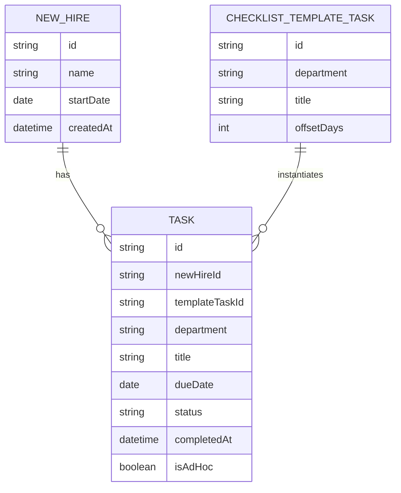

# Domain Model

The tracker centers on a new hire and the tasks their onboarding creates. Each
task either comes from the standard checklist template or was added as a
one-off exception, and always belongs to exactly one department.

- **NEW\_HIRE** — a person being onboarded; `startDate` drives every task's due
date.
- **CHECKLIST\_TEMPLATE\_TASK** — the standing checklist HR maintains, one row
per department task with a fixed day `offsetDays` from the start date
(negative = before, positive = after).
- **TASK** — one instance of work for one new hire, in one `department`
(`HR` | `IT` | `Facilities`). `dueDate` is computed once, at creation, from
the new hire's `startDate` plus the template's `offsetDays`, or set directly
when HR adds a one-off (`isAdHoc`) task. `status` is `open` or `complete`; a
task is overdue when `status` is `open` and `dueDate` has passed.

