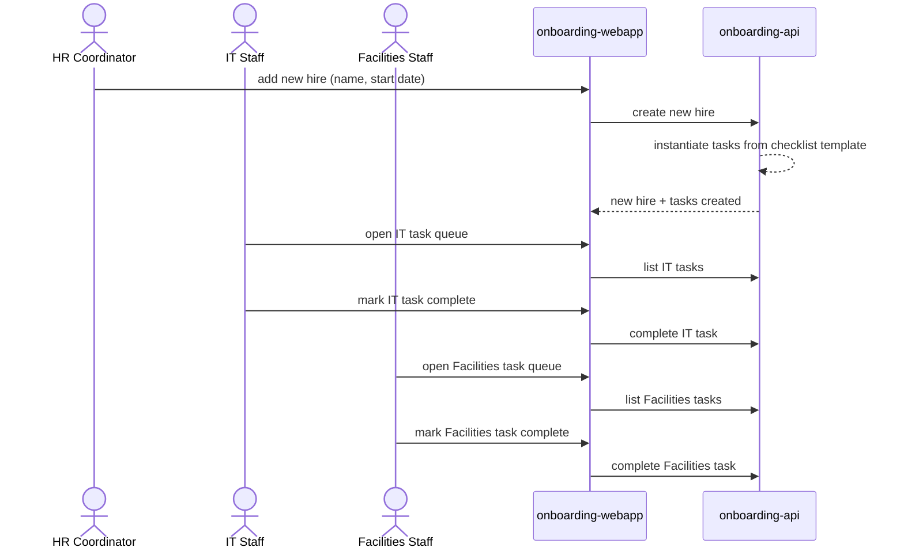

# New hire onboarding

An HR Coordinator adds a new hire and the standard checklist is instantiated
across all three departments; each department later works and completes its
own tasks.

```mermaid
sequenceDiagram
    actor HR as HR Coordinator
    actor IT as IT Staff
    actor Facilities as Facilities Staff

    participant onboarding-webapp
    participant onboarding-api

    HR->>onboarding-webapp: add new hire (name, start date)
    onboarding-webapp->>onboarding-api: create new hire
    onboarding-api-->>onboarding-api: instantiate tasks from checklist template
    onboarding-api-->>onboarding-webapp: new hire + tasks created

    IT->>onboarding-webapp: open IT task queue
    onboarding-webapp->>onboarding-api: list IT tasks
    IT->>onboarding-webapp: mark IT task complete
    onboarding-webapp->>onboarding-api: complete IT task

    Facilities->>onboarding-webapp: open Facilities task queue
    onboarding-webapp->>onboarding-api: list Facilities tasks
    Facilities->>onboarding-webapp: mark Facilities task complete
    onboarding-webapp->>onboarding-api: complete Facilities task
```

