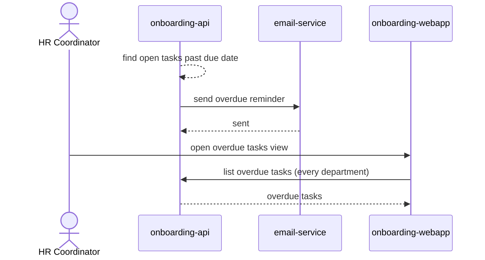

# Overdue reminder

Every day, the onboarding API finds open tasks past their due date and emails
a reminder to the owning department; HR can see every overdue task across
departments in one place.

